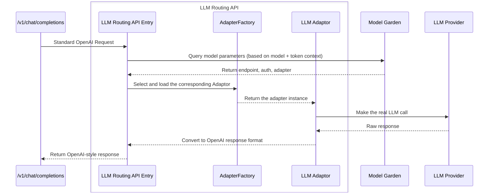
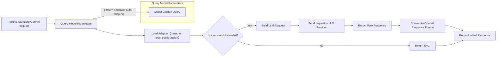

# LLM Routing API Design Document (Internal Sub-interface)

## 1. API Description

The **LLM Routing API** is an **internal sub-module** in the request processing chain for the unified OpenAI-style `/v1/chat/completions` endpoint. It dynamically selects the appropriate LLM provider and makes the actual call based on the model name, the caller's context (including `service account`, `AD group`, `use case`, and `model`), which is embedded in the token of the request.

Although this API is not directly exposed externally, it adheres to the OpenAI Chat Completion standard. Its goals are:

- To remain compatible with the main entry point for logic reuse;
- To standardize the request/response format and unify the Adapter plugin development;
- To provide a clear boundary for responsibilities within the call chain.

This API loads the appropriate **Adaptor** through an internal component mechanism, transforming the standard OpenAI request format into the respective LLM provider's calling protocol. It supports timeout control, automatic retries, authentication injection, response parsing, and unified exception handling.

---

## 2. API Definition (Compatible with OpenAI Chat Completion)

> This API is only used for routing calls within the main process and is not directly exposed to business systems.

```http
POST /internal/llm/route
Authorization: InternalServiceToken
Content-Type: application/json
```

The request and response structure is identical to `/v1/chat/completions`:

### Request Body (Example)

```json
{
  "model": "qwen-72b-chat",
  "messages": [
    {"role": "user", "content": "Please generate a product introduction"}
  ],
  "stream": false
}
```

### Response Body (Example)

```json
{
  "id": "chatcmpl-xxx",
  "object": "chat.completion",
  "created": 1699999999,
  "model": "qwen-72b-chat",
  "choices": [
    {
      "index": 0,
      "message": {
        "role": "assistant",
        "content": "This is a powerful AI product..."
      },
      "finish_reason": "stop"
    }
  ],
  "usage": {
    "prompt_tokens": 90,
    "completion_tokens": 40,
    "total_tokens": 130
  }
}
```

---

## 3. API Processing Flow

### 3.1 Sequence Diagram



---

### 3.2 Flow Diagram



---

## 4. Development Language and Plugin Mechanism Considerations

| **Feature**        | **Python**               | **Java**               |
|--------------------|--------------------------|------------------------|
| **Development Speed**   | ⭐⭐⭐⭐⭐                   | ⭐⭐⭐                   |
| **Flexibility**     | ⭐⭐⭐⭐⭐ (Supports dynamic loading and plugin mechanism) | ⭐⭐ (Static typing, supports plugins but less flexible) |
| **Performance**     | ⭐⭐⭐ (Suitable for I/O-bound tasks, performance bottleneck) | ⭐⭐⭐⭐⭐ (Suitable for high concurrency, large-scale systems) |
| **Concurrency**     | ⭐⭐⭐ (Supports async IO, performance is weaker) | ⭐⭐⭐⭐⭐ (Efficient multi-threading and concurrency handling) |
| **AI Ecosystem Support** | ⭐⭐⭐⭐⭐ (Strong support for machine learning libraries) | ⭐⭐ (AI ecosystem is not as rich as Python) |
| **Adapter Mechanism**   | ⭐⭐⭐⭐⭐ (Dynamic loading, plugin mechanism) | ⭐⭐⭐ (Plugin support is weaker, needs to use SPI) |
| **Extensibility**   | ⭐⭐⭐⭐⭐ (Easy to add new LLM providers) | ⭐⭐⭐⭐ (Good extensibility, but more complex development) |
| **System Stability**   | ⭐⭐⭐ (Relatively weak compared to Java, may have stability issues) | ⭐⭐⭐⭐⭐ (Enterprise-grade stability, suitable for high load) |
| **Community Support**  | ⭐⭐⭐⭐⭐ (Widely used in AI and data science ecosystems) | ⭐⭐⭐⭐ (Enterprise development ecosystem is well-established) |

### Adapter Plugin Mechanism Recommendations

#### **Python Recommended Use Cases**

- **Rapid Development and Prototyping**: Python is ideal for fast iterations and quickly integrating new LLM providers.
- **Adapter Plugin Mechanism**: Python excels at dynamic loading and plugin mechanisms, making it easy to add new LLM providers without modifying the main logic.
- **AI Ecosystem**: Python has a rich AI ecosystem, allowing you to leverage existing libraries and frameworks (such as HuggingFace, TensorFlow).
- **I/O-Bound Tasks**: Python is well-suited for I/O-bound tasks, such as API calls, thanks to its asynchronous capabilities.

#### **Java Recommended Use Cases**

- **Existing Java Tech Stack**: If your system already uses Java and has high concurrency or stability requirements, Java is a better fit.
- **High Performance**: Java is better suited for high concurrency, heavy loads, and high availability needs.
- **Enterprise Systems**: Java's stability, scalability, and strong support for microservices make it ideal for large-scale enterprise systems.

#### **Adapter Interface**

```python
class LLMAdapter:
    def build_request(self, input: dict, config: dict) -> dict
    def invoke(self, payload: dict) -> dict
    def parse_response(self, raw: dict) -> dict
```

---

## 5. Other Key Considerations

| Category           | Considerations | Recommendations |
|--------------------|----------------|-----------------|
| Security           | LLM calls need authentication information | Ensure dynamic injection and caching of headers from Model Garden |
| Retry Mechanism    | Network issues, rate-limiting, timeouts require retries | Support exponential backoff, configurable retries (up to 3 times) |
| Timeout Control    | Model response should not wait indefinitely | Support per-request timeout and fallback hooks |
| Circuit Breaker & Degradation | Should a failed model fall back? | Implement circuit breaker strategies (e.g., return fixed response or route to backup model) |
| Streaming Support  | Should streaming responses be handled? | Adaptor must handle chunking and stream response formatting |
| Error Handling     | Models have varying response structures | Standardize error responses (e.g., 429, timeout, authfail) |
